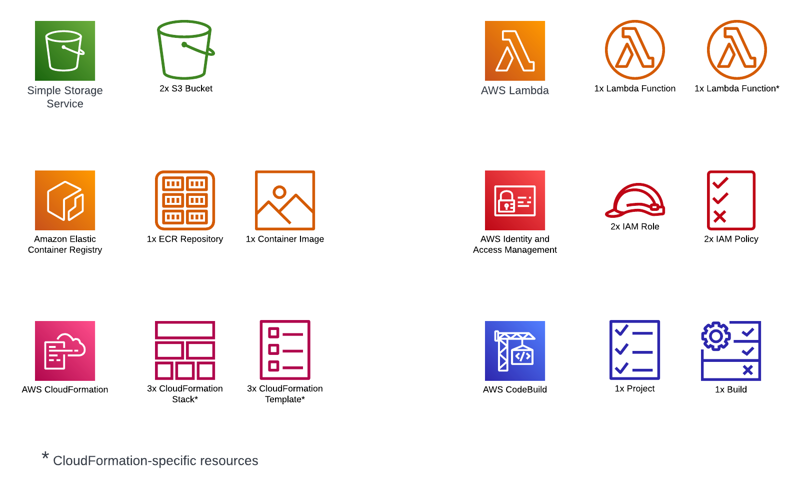

# 3xImplementation: S3 Thumbnail Creator

This is the first in a series of articles that compares the implementation of multiple basic architectures in 3 different ways: Terraform, AWS CloudFormation, and AWS Python SDK (boto3).
The source code for this article can be found on GitHub: [https://github.com/Faaizz/cloud_learnings/tree/main/s3_thumbnail_creator](https://github.com/Faaizz/cloud_learnings/tree/main/s3_thumbnail_creator).

## Architecture
The architecture in this episode is a serverless application that automatically generates thumbnails of images uploaded in one S3 bucket (Source bucket) and saves them in another S3 bucket (Destination bucket).
A basic layout is shown in the image below:


## Resources
A few AWS resources are required for this application and its deployment.
First, we have two S3 buckets, the Source bucket and the Destination bucket.
Then, there's the Lambda function that holds the thumbnail generation logic, whose source code lives in a [GitHub repository](https://github.com/Faaizz/s3_thumbnail_creator.git).
An ECR repository is created to hold the container image, and a CodeBuild project is used to build the image and push it to ECR.
For the CloudFormation implementation, an extra Lambda function is needed for the Macro that generates S3 bucket names.




## Some Notes
For the CloudFormation implementation, the stacks must be provisioned in some way, this is achieved with minimal `go` scripts utilizing the AWS Go SDK.

Also, as the application is not embedded within a CI/CD system, the "build" step needs to be triggered in some way.
For the Terraform implementation, a `provider` block is used (I know, using providers is bad practice :-X).
The Python SDK implementation includes this in the `python` scripts that make the API calls, and the CloudFormation implementation incorporates this in its `go` scripts.

## Implementation
### ECR Repository
The most independent resource of this application's entire stack is the ECR repository.
It does not require information from any other resource.
Below is the creation of the ECR repository in all 3 implementations:
```h
# Terraform
resource "aws_ecr_repository" "my_repo_terraform" {
  name = local.ecr_repo_name
  # Forcefully delete all images to facilitate destroy
  force_delete = true

  tags = local.uniform_tags
}
```
```yaml
# CloudFormation
...
Resources:
  ThumbnailCreatorECRRepository:
    Type: AWS::ECR::Repository
...
```
```python
# Python SDK
ecr_client = boto3.client('ecr')
ecr_client.create_repository(
  repositoryName=ecr_repo_name,
  tags=uniform_tags,
)
```

### CodeBuild
A CodeBuild project is used to package the Thumbnail Generation lambda function as a container image.
An IAM service role is set up for CodeBuild with permissions to write to CloudWatch logs and push to ECR.
The CodeBuild project's `buildspec.yaml` is included with the Thumbnail Generation lambda source code and is provided below.
```yaml
version: 0.2

phases:
  pre_build:
    commands:
      - echo Logging in to Amazon ECR...
      - aws ecr get-login-password --region $AWS_DEFAULT_REGION | docker login --username AWS --password-stdin $AWS_ACCOUNT_ID.dkr.ecr.$AWS_DEFAULT_REGION.amazonaws.com
  build:
    commands:
      - echo Build statred at `date`
      - echo Building Docker image
      - docker build -t $IMAGE_REPO_NAME:$IMAGE_TAG .
      - docker tag $IMAGE_REPO_NAME:$IMAGE_TAG $AWS_ACCOUNT_ID.dkr.ecr.$AWS_DEFAULT_REGION.amazonaws.com/$IMAGE_REPO_NAME:$IMAGE_TAG
  post_build:
    commands:
      - echo Build completed at `date`
      - echo Pushing image to ECR repo...
      - docker push $AWS_ACCOUNT_ID.dkr.ecr.$AWS_DEFAULT_REGION.amazonaws.com/$IMAGE_REPO_NAME:$IMAGE_TAG
```
The build steps are quite simple, and all the required data is provided via environment variables.
The pre-build step logs into the ECR repository.
The actual build step builds the docker image and tags it accordingly.
In the post-build stage, the image is pushed to the ECR repository.

Across the three implementations, this CodeBuild project was fairly easy to set up.

Since no artifact is produced---the docker image is not considered as an artifact by CodeBuild, it is pushed to ECR as a part of the build---the major focus is on properly setting up the environment.
A `LINUX_CONTAINER` build environment type with a standard CodeBuild image (`aws/codebuild/standard:4.0`) is used. `privilege_mode` is enabled (to use docker in docker---`dind`) and the required authentication & tagging data are passed to the build environment via environment variables.
The source is specified as a GitHub repository located at [https://github.com/Faaizz/cloud_learnings/tree/main/s3_thumbnail_creator](https://github.com/Faaizz/cloud_learnings/tree/main/s3_thumbnail_creator).

*At the time of this writing, according to the [CloudFormation documentation]() if the source code is a GitHub repository, "You must connect your AWS account to your GitHub account". This I've found to be inaccurate for a public GitHub repository (as used in this project).*


### Thumbnail Generation Lambda

*TL;DR*
- *CloudFormation requires S3 Bucket Notifications to be configured when declaring a bucket. This can result in cyclic dependencies when other resources also need information about the bucket in their declaration.*
- *Python SDK requires that a lambda function be active before permissions can be configured. This can usually be implemented using a waiter.*

Now that the container image for the Thumbnail Generation lambda has been built and pushed to ECR, the lambda function that uses it can be defined.
The process of creating the lambda function in all 3 implementations is pretty straightforward.
The only caveat is that, in specifying the trust permission to allow the Source S3 bucket invoke the lambda function, the Source buckets ARN has to be manually constructed (as `aws:arn:s3:::<source_bucket_name>`) to avoid cyclic dependencies. This is because the lambda function's ARN is required to configure S3 bucket notifications on the Source S3 bucket, and in CloudFormation, S3 bucket notifications must be specified at bucket declaration time.

With Terraform, the `aws_lambda_function` and `aws_lambda_permission` resource blocks create the lambda function and updates its resource policy to allow invocation from the Source S3 bucket. An execution role is setup with the `aws_iam_role` resource block, with a policy attached to grant CloudWatch logs permissions, and allow the lambda function to save the created thumbnails to the Destination S3 bucket.

In the Python SDK implementation, after making the API call to create the lambda function, a waiter needs to be configured to pause the execution until the newly created function is active. This helps to prevent any errors when trying to grant invocation permissions to the Source bucket (since permissions can only be added when the function becomes active).
```python
lambda_client.boto3.client('lambda')
waiter = lambda_client.get_waiter('function_active')
waiter.wait(
  FunctionName=lambda_function_name,
  WaiterConfig={
      'Delay': 5,
      'MaxAttempts': 60,
  }
)
```


### S3 Bucket Name Macro

*TL;DR*
- *CloudFormation does not have mechanisms to generate random numbers out of the box.*
- *CloudFormation macros must be created before they can be used.*

Python and Terraform provide mechanisms to generate pseudo-random numbers (e.g., `rand.randint` and the `random` provider's `random_integer` respectively). CloudFormation does not have such mechanisms out of the box.
To complement this, a lambda function backed Macro is utilized to generate S3 bucket names for the CloudFormation implementation as shown below.
```yaml
...
Resources:
  RandomBucketNameLambda:
    Type: AWS::Lambda::Function
    Properties:
      Role: !GetAtt
          - RandomBucketNameLambdaRole
          - Arn
      Runtime: python3.9
      Description: Lambda function that generates random S3 bucket names
      Code:
        ZipFile: |
          import random
          def handler(event, context):
            name_prefix = event['params']['Prefix']
            random_bucket_name = '{}-{}'.format(name_prefix, random.randint(5000, 9000))
            return {
              'requestId': event['requestId'],
              'status': 'success',
              'fragment': random_bucket_name,
            }
      Handler: index.handler
  RandomBucketNameMacro:
    Type: AWS::CloudFormation::Macro
    Properties:
      Name: !Ref MacroName
      Description: Generate random bucket name
      # Gotcha ARN here, not function name
      FunctionName: !GetAtt
        - RandomBucketNameLambda
        - Arn
...
```
The function logic is provided to the CloudFormation template in-line, hence, no external source is configured.

It is worthy to note that CloudFormation macros must exist before they can be used. I.e., a stack must be created from the template that declares a macro before the macro can be used in other templates. You CANNOT declare and use a macro in the same template.


### S3 Buckets
Creation of S3 buckets and bucket notifications is quite mundane across all three implementations.
The only tricky part is CloudFormation's requirement that bucket notification configuration be configured while declaring the S3 bucket (which has been discussed in the **Thumbnail Generation Lambda** section).

## Cleanup

*TL;DR*
- *Terraform is the best of the 3 in terms of cleanup.*

Terraform handles cleanup seamlessly due to it's state-tracking mechanism.
For resources that can have child resources---e.g., S3 buckets and ECR repositories---specifying a `force_destroy` attribute in the terraform resource block is enough to enable terraform automatically delete all child resources at cleanup time to allow deletion of the parent resource. With terraform, resource cleanup is as simple as running `terraform destroy --auto-approve`.

For CloudFormation, deployed resources can be deleted by deleting the stack in which they're contained. However, there is no magic-trick to enforce deletion of parent resources with existing child resources.

Cleaning up resources deployed in the Python SDK implementation required some extra efforts.
The identifiers of deployed resources are tracked in a JSON file, which is then loaded into the cleanup script.
For parent resources with existing child resources, the child resources are traversed and deleted.

## References

### Terraform
- [https://registry.terraform.io/providers/hashicorp/aws/latest/docs](https://registry.terraform.io/providers/hashicorp/aws/latest/docs)

### CloudFormation
- [https://docs.aws.amazon.com/AWSCloudFormation/latest/UserGuide/template-reference.html](https://docs.aws.amazon.com/AWSCloudFormation/latest/UserGuide/template-reference.html)
- [https://docs.aws.amazon.com/AWSCloudFormation/latest/UserGuide/aws-product-attribute-reference.html](https://docs.aws.amazon.com/AWSCloudFormation/latest/UserGuide/aws-product-attribute-reference.html)
- [https://docs.aws.amazon.com/AWSCloudFormation/latest/UserGuide/pseudo-parameter-reference.html](https://docs.aws.amazon.com/AWSCloudFormation/latest/UserGuide/pseudo-parameter-reference.html)

### CodeBuild
- [https://docs.aws.amazon.com/codebuild/latest/userguide/sample-docker.html](https://docs.aws.amazon.com/codebuild/latest/userguide/sample-docker.html)
- [https://docs.aws.amazon.com/codebuild/latest/userguide/getting-started-cli-create-build-project.html](https://docs.aws.amazon.com/codebuild/latest/userguide/getting-started-cli-create-build-project.html)

### AWS SDK
- [https://docs.aws.amazon.com/sdk-for-go/](https://docs.aws.amazon.com/sdk-for-go/)
