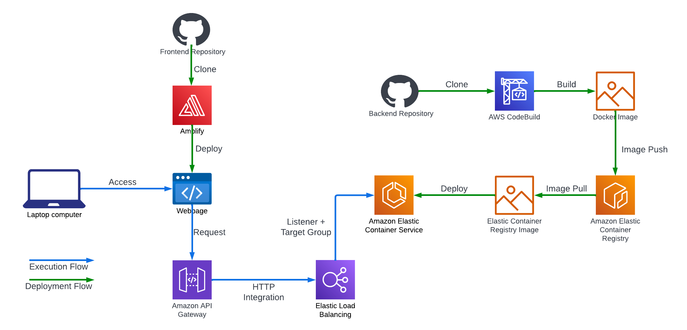

# 3xImplementation: WebSocket Chat Application

**Note: Architectures illustrated are for educational purposes ONLY. They do no necessarily follow best practices and are NOT suitable for production.**

## Requirements
- [ ] AWS account with programmatic access, i.e., `ACCESS_KEY_ID` and `SECRET_ACCESS_KEY`
- [ ] GitHub account with the frontend application source repository cloned and a personal access token that provides access to the repository

## Implementation 1: Architecture

## Notes
- [ ] HTTP endpoint for WebSocket API in API Gateway: Integration requests have to be set up to deliver the `connectionId` to the backend endpoint
- [ ] Callback URL for WebSocket API must be configured for the Go SDK using an EndpointResolver
## Gotchas
- [ ] IAM Service Role must be created for AWS API GW to write to CW Logs. See https://docs.aws.amazon.com/apigateway/latest/developerguide/set-up-logging.html
- [ ] Default integration response must be configured for WebSocket API routes that use integration (non-proxy) HTTP backend (otherwise nothing is returned).
- [ ] `throttling_burst_limit` and `throttling_rate_limit` must be set if `route_settings` is configured. Otherwise, weird "429 throttling limit exceeded error" on API endpoint. 
- [ ] `aws_api_gateway_account` resource is needed to configure API Gateway's `cloudwatch_role_arn`
- [ ] `aws_apigatewayv2_stage.default_route_settings` holds default settings for all routes (not settings for the default route as stated in the docs: https://registry.terraform.io/providers/hashicorp/aws/latest/docs/resources/apigatewayv2_stage#default_route_settings)
- [ ] `aws_amplify_branch` adds webhooks on the destination GitHub repository and does not destroy them on `terraform destroy`
- [ ] Ensure that 
## Problems
- [ ] Use stageVariables in aws_apigatewayv2_integration

## References
- [https://docs.amplify.aws/guides/hosting/nextjs/q/platform/js/#dynamic-routes](https://docs.amplify.aws/guides/hosting/nextjs/q/platform/js/#dynamic-routes)
