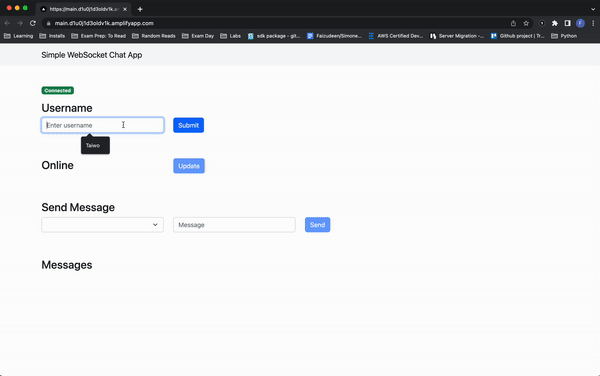
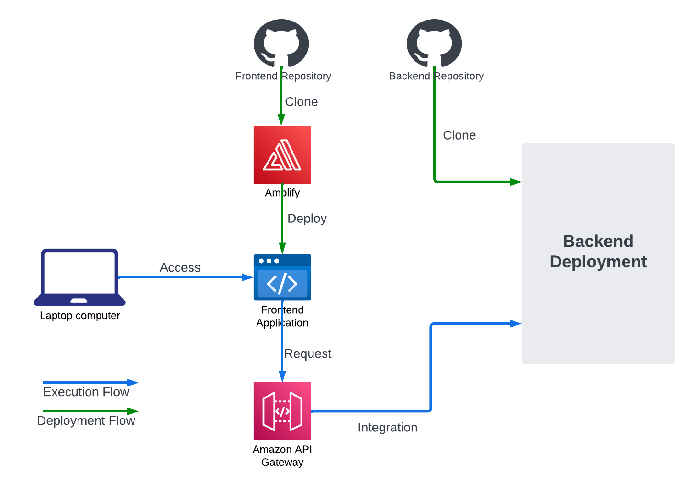

# 3xImplementation: WebSocket Chat Application

**Note: Architectures illustrated are for educational purposes ONLY. They do no necessarily follow best practices and are NOT suitable for production.**

## Requirements
- [ ] AWS account with programmatic access, i.e., `ACCESS_KEY_ID` and `SECRET_ACCESS_KEY`
- [ ] GitHub account with the frontend and backend application source repositories cloned and a personal access token that provides access to the cloned repositories.

## WebSocket Chat Application
The WebSocket chat application developed here is a simplistic one.
It allows isolated one-to-one communication between multiple users using the WebSocket protocol.  

## Architecture

The core application architecture consists of a backend deployment, API endpoints, and a frontend web application. The backend deployment is accessible via the API endpoints from the frontend web application. 

The frontend web application and the API endpoints are deployed across all three implementations using the AWS Amplify and API Gateway services respectively.

In the architecture diagrams presented in this article, green lines signify deployment flows, while blue lines indicate the path through which application execution follows.

## Implementation 1: Architecture

## Notes
- [ ] HTTP endpoint for WebSocket API in API Gateway: Integration requests have to be set up to deliver the `connectionId` to the backend endpoint
- [ ] Callback URL for WebSocket API must be configured for the Go SDK using an EndpointResolver
## Gotchas
- [ ] IAM Service Role must be created for AWS API GW to write to CW Logs. See https://docs.aws.amazon.com/apigateway/latest/developerguide/set-up-logging.html
- [ ] Default integration response must be configured for WebSocket API routes that use integration (non-proxy) HTTP backend (otherwise nothing is returned).
- [ ] `throttling_burst_limit` and `throttling_rate_limit` must be set if `route_settings` is configured. Otherwise, weird "429 throttling limit exceeded error" on API endpoint. 
- [ ] `aws_api_gateway_account` resource is needed to configure API Gateway's `cloudwatch_role_arn`
- [ ] `aws_apigatewayv2_stage.default_route_settings` holds default settings for all routes (not settings for the default route as stated in the docs: https://registry.terraform.io/providers/hashicorp/aws/latest/docs/resources/apigatewayv2_stage#default_route_settings)
- [ ] `aws_amplify_branch` adds webhooks on the destination GitHub repository and does not destroy them on `terraform destroy`
- [ ] `aws_apigatewayv2_stage.invoke_url` gives the WebSocket URL to invoke the API. The HTTP URL needed for `@connections` API is not provided. Had to be formed by manipulating the returned wss:// URL.
- [ ] The `/message` route requires the `@connections` API URL which is only available after creating the stage--hence, the deployment. To enable an automated deployment after adding the `/message` route, `aws_apigatewayv2_stage.dev.auto_deploy` is set `true`.
## Problems
- [ ] Use stageVariables in aws_apigatewayv2_integration

## References
- [https://docs.amplify.aws/guides/hosting/nextjs/q/platform/js/#dynamic-routes](https://docs.amplify.aws/guides/hosting/nextjs/q/platform/js/#dynamic-routes)
